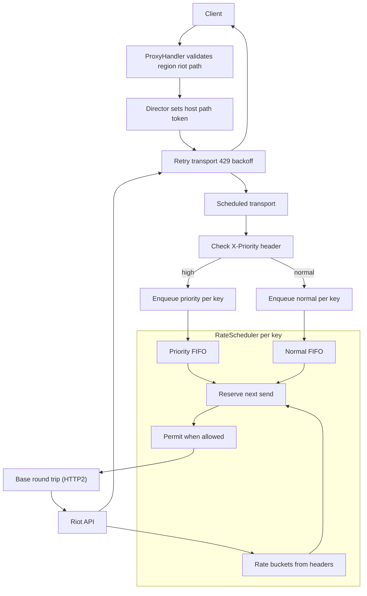

```mermaid
flowchart TD
  client[Client] --> proxyIngress[ProxyHandler validates region riot path]
  proxyIngress --> director[Director sets host path token]
  director --> retry[Retry transport 429 backoff]
  retry --> schedTransport[Scheduled transport]
  schedTransport --> classify[Check X-Priority header]

  classify -->|high| priorityEnqueue["Enqueue priority per key"]
  classify -->|normal| normalEnqueue["Enqueue normal per key"]

  subgraph scheduler["RateScheduler per key"]
    priorityQueue[Priority FIFO]
    normalQueue[Normal FIFO]
    buckets["Rate buckets from headers"]
    dispatcher[Reserve next send]
    priorityQueue --> dispatcher
    normalQueue --> dispatcher
    buckets --> dispatcher
    dispatcher --> permit[Permit when allowed]
  end

  priorityEnqueue --> priorityQueue
  normalEnqueue --> normalQueue
  permit --> baseRT["Base round trip (HTTP2)"]
  baseRT --> upstream[Riot API]
  upstream --> buckets
  upstream --> retry
  retry --> client
  
  click proxyIngress "https://github.com/renja-g/rp/blob/main/internal/router/path.go#L88"
  click director "https://github.com/renja-g/rp/blob/main/internal/proxy/proxy.go#L70"
  click retry "https://github.com/renja-g/rp/blob/main/internal/transport/retry.go#L14"
  click schedTransport "https://github.com/renja-g/rp/blob/main/internal/proxy/scheduled_transport.go#L15"
  click classify "https://github.com/renja-g/rp/blob/main/internal/proxy/scheduled_transport.go#L15"
  click priorityEnqueue "https://github.com/renja-g/rp/blob/main/internal/proxy/scheduler.go#L137"
  click normalEnqueue "https://github.com/renja-g/rp/blob/main/internal/proxy/scheduler.go#L137"
  click scheduler "https://github.com/renja-g/rp/blob/main/internal/proxy/scheduler.go#L123"
  click priorityQueue "https://github.com/renja-g/rp/blob/main/internal/proxy/scheduler.go#L40"
  click normalQueue "https://github.com/renja-g/rp/blob/main/internal/proxy/scheduler.go#L40"
  click buckets "https://github.com/renja-g/rp/blob/main/internal/ratelimit/state.go#L21"
  click dispatcher "https://github.com/renja-g/rp/blob/main/internal/proxy/scheduler.go#L58"
  click permit "https://github.com/renja-g/rp/blob/main/internal/proxy/scheduler.go#L58"
  click baseRT "https://github.com/renja-g/rp/blob/main/internal/proxy/proxy.go#L124"
  click upstream "https://developer.riotgames.com/apis"
```