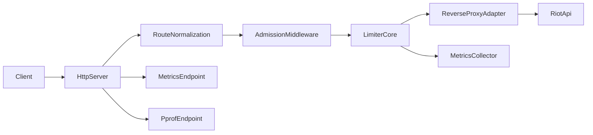
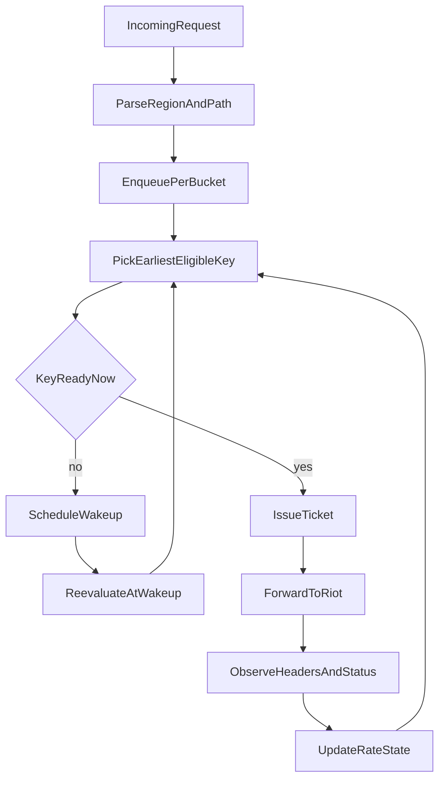

# RiftRelay

RiftRelay is a high-throughput Riot API relay with centralized admission control.
It is designed as a clean Go v2: explicit lifecycle, bounded queues, event-driven scheduling, and low-overhead request forwarding.

## Goals

- Keep request latency predictable under load.
- Prevent upstream overload with admission control instead of blind retries.
- Stay idiomatic Go: small focused packages, explicit errors, context-aware flow.

## Architecture



### Admission and scheduling model



The scheduler enforces upstream windows and applies dynamic pacing inside the active window (`time_left / requests_left`) so requests are spread instead of clumping at reset boundaries.

## Project layout

- `main.go`: process entrypoint and signal handling.
- `internal/app`: server lifecycle (`Start`, `Shutdown`), route wiring, metrics/pprof endpoints.
- `internal/config`: typed env parsing and validation.
- `internal/router`: canonical path parsing and bucket key generation.
- `internal/limiter`: event-driven admission/scheduler core.
- `internal/proxy`: reverse proxy adapter + admission middleware.
- `internal/transport`: tuned `http.Transport` builder.
- `internal/metrics`: lightweight metrics collector endpoint.

## Quick start

### 1) Prerequisites

- Go 1.26+ (matching `go.mod`)
- A valid Riot API token

### 2) Run locally

```bash
export RIOT_TOKEN="your-riot-token"
go run .
```

Default listen address is `http://localhost:8985`.

### 3) Run with Docker (production profile)

```bash
cp .env.example .env
```

Set `RIOT_TOKEN` in `.env`, then run:

```bash
docker compose up -d --build
```

Follow logs:

```bash
docker compose logs -f riftrelay
```

Stop:

```bash
docker compose down
```

### 4) Send a request

```bash
curl -i "http://localhost:8985/na1/lol/status/v4/platform-data"
```

Priority override:

```bash
curl -i -H "X-Priority: high" "http://localhost:8985/euw1/lol/status/v4/platform-data"
```

## Routing

Incoming route format:

```text
/{region}/{riot-api-path}
```

Examples:

- `/na1/lol/status/v4/platform-data`
- `/euw1/lol/summoner/v4/summoners/by-name/someone`

If the path is invalid, RiftRelay returns `400 Bad Request`.

## Configuration

`RIOT_TOKEN` is required. Multiple tokens are supported via comma-separated values.

| Variable | Required | Default | Example |
| --- | --- | --- | --- |
| `RIOT_TOKEN` | yes | - | `tokenA,tokenB` |
| `PORT` | no | `8985` | `9090` |
| `QUEUE_CAPACITY` | no | `2048` | `4096` |
| `ADMISSION_TIMEOUT` | no | `12s` | `5s` |
| `ADDITIONAL_WINDOW_SIZE` | no | `125ms` | `200ms` |
| `SHUTDOWN_TIMEOUT` | no | `20s` | `10s` |
| `UPSTREAM_TIMEOUT` | no | `0` (disabled) | `3s` |
| `ENABLE_METRICS` | no | `true` | `false` |
| `ENABLE_PPROF` | no | `false` | `true` |
| `ENABLE_SWAGGER` | no | `true` | `false` |
| `SERVER_READ_HEADER_TIMEOUT` | no | `10s` | `5s` |
| `SERVER_READ_TIMEOUT` | no | `10s` | `5s` |
| `SERVER_WRITE_TIMEOUT` | no | `30s` | `20s` |
| `SERVER_IDLE_TIMEOUT` | no | `120s` | `90s` |
| `TRANSPORT_MAX_IDLE_CONNS` | no | `512` | `1024` |
| `TRANSPORT_MAX_IDLE_CONNS_PER_HOST` | no | `256` | `512` |
| `TRANSPORT_MAX_CONNS_PER_HOST` | no | `0` (unlimited) | `200` |
| `TRANSPORT_IDLE_CONN_TIMEOUT` | no | `90s` | `60s` |
| `TRANSPORT_TLS_HANDSHAKE_TIMEOUT` | no | `10s` | `5s` |
| `TRANSPORT_EXPECT_CONTINUE_TIMEOUT` | no | `1s` | `500ms` |
| `TRANSPORT_DIAL_TIMEOUT` | no | `5s` | `2s` |
| `TRANSPORT_DIAL_KEEP_ALIVE` | no | `30s` | `20s` |
| `TRANSPORT_RESPONSE_HEADER_TIMEOUT` | no | `15s` | `8s` |
| `TRANSPORT_FORCE_HTTP2` | no | `true` | `false` |

## Metrics and profiling

- Health endpoint: `GET /healthz`
- Metrics endpoint (when enabled): `GET /metrics`
- pprof endpoints (when enabled):
  - `/debug/pprof/`
  - `/debug/pprof/profile`
  - `/debug/pprof/trace`
- Swagger UI (when enabled): `GET /swagger/`
- Swagger spec proxy (when enabled): `GET /swagger/openapi.json`

## Development

Run tests:

```bash
go test ./...
```

Run race detector on core packages:

```bash
go test -race ./internal/config ./internal/router ./internal/limiter ./internal/proxy
```

Run benchmarks:

```bash
go test -run '^$' -bench . -benchmem ./internal/limiter ./internal/proxy
```

## Operational notes

- Admission rejects return `429 Too Many Requests` and include `Retry-After`.
- Accepted requests are paced across remaining window budget to smooth bursts.
- `X-Priority: high` bypasses pacing delay but still respects hard rate limits and `Retry-After` blocks.
- On shutdown, the server drains with a timeout (`SHUTDOWN_TIMEOUT`).
- Use multiple Riot tokens for better throughput and safer burst handling.
